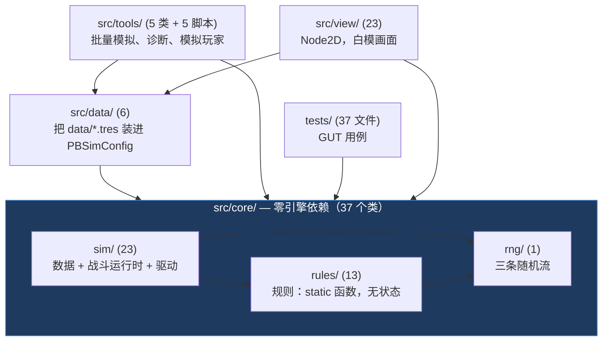
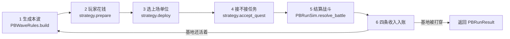
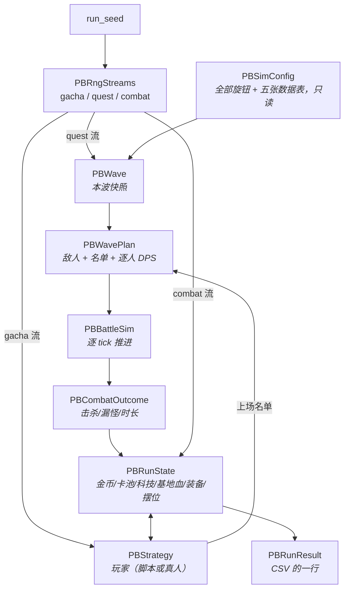

# 代码导读

写给「想看懂 `src/` 里在干什么」的人。
`src/` 约 14800 行 / 71 个 `class_name` + 5 个命令行脚本，`tests/` 约 7000 行 / 37 个文件。

和 [Godot上手笔记.md](Godot上手笔记.md) 分工：**那份讲 Godot 通用概念**（节点树、
生命周期、语法、信号）；**这份讲本项目的结构**，以及一件反常识的事 ——
游戏逻辑刻意**不用**那套节点树。

> 覆盖到 **M4**（二维战场）。`§xx` 一律指 [施工策划案.md](施工策划案.md)。

---

## 0. 先说最反直觉的一点

Godot 的世界观是「**万物皆 Node**」。你打开任何一个 Godot 教程，看到的都是
节点树、`_ready()`、`_process(delta)`、`$Sprite2D`。

**但 `src/core/` 的 37 个类里，一个 Node 都没有。**

```gdscript
class_name PBRunSim
extends RefCounted     ← 不是 Node，不是 Node2D，是 RefCounted
```

|                  | 典型 Godot 项目               | 本项目`src/core/`                   |
| ---------------- | ----------------------------- | ------------------------------------- |
| 基类             | `Node` / `Node2D`         | `RefCounted`（个别是 `Resource`） |
| 谁驱动           | 引擎每帧调`_process(delta)` | 我们自己写`while` 循环              |
| 时间从哪来       | `delta`（每帧不定）         | 固定 20 tick/s，自己数                |
| 随机数           | `randi()`                   | 自己持有的`RandomNumberGenerator`   |
| 怎么找到别的对象 | `get_node("Path")`          | 函数参数传进去                        |
| 生命周期         | `queue_free()`              | 引用计数，没人引用就自动没了          |

这不是「还没写到那一步」，是**故意的**，而且有一条自动化防线守着它 ——
`check.ps1` 的第 2 阶段会 grep `src/core/`，出现 `get_node`、`randi(`、
`delta`、`extends Node` 就直接报错。

### 为什么要这么做

因为这四样能力**全部依赖同一个前提：逻辑是纯函数，输入一样输出必然一样**。

| 能力                           | 靠什么                                                      |
| ------------------------------ | ----------------------------------------------------------- |
| **确定性**               | 存档回滚、每日种子挑战、战报回放都要求「同种子必出同结果」  |
| **可单元测试**           | `tests/` 直接 `PBRunSim.run(...)`，不用起场景、不用等帧 |
| **可 headless 批量模拟** | 上万局跑几分钟。带节点树的话光实例化就跑不动                |
| **可换渲染层**           | 逻辑不知道自己有没有画面，M0 加 view 层时 sim 一行不动      |

一旦 sim 里混进 `get_node()` 或读了 `delta`，这四样会**一起**失效，
而且拆回来基本等于重写。所以它是「铁律」而不是「建议」。

> 用 UE 的话说：`src/core/` 是一个不依赖 `UWorld` 的纯 C++ 模块，
> 既不是 Actor 也不是 Component，你可以在命令行工具里直接链接它跑。

---

## 1. 分层与依赖方向



**箭头方向不能反。** `core` 引用 `tools` 就等于把模拟脚手架焊进了游戏逻辑，
接真 UI 时会拆不掉；`core` 引用 `data` 会把 `ResourceLoader` 拖进纯度检查里。

| 目录            | 能不能用引擎 API | 说明                                                      |
| --------------- | ---------------- | --------------------------------------------------------- |
| `src/core/`   | **不能**   | 被`check.ps1` 阶段 2 强制                               |
| `src/data/`   | 能               | 装`.tres` 必须用 `ResourceLoader`，所以它在 core 外面 |
| `src/tools/`  | 能               | 批量模拟要读命令行参数、写文件                            |
| `src/view/`   | 能               | 就是渲染层。**只读 sim，不回写**（一个例外见 §7）  |
| `tests/`      | 能               | GUT 本身是节点                                            |
| `src/player/` | —               | 早期脚手架，跟游戏无关，可以删                            |

---

## 2. 一局游戏是怎么跑的

入口是 [`PBRunSim.run()`](../src/core/sim/run_sim.gd)，一个 `while` 循环，每波六步：



**顺序是刻意排的，换了结果就变：**

- **2 在 3 之前** —— 这一波抽到的卡，这一波就能上
- **4 必须在 5 之前** —— 派遣会同时削掉羁绊加成**和一个打手**（M3.5-i 删掉待命台之后）
- **6 里的被动收入按战斗时长算** —— 准备阶段不限时（§01），
  让它在准备阶段产出等于挂机就是无限金币

真人玩的时候第 2–4 步会**停下来等玩家**，所以 `run()` 里那几段各自拆成了
公开的静态函数（`begin_wave` / `lock_plan` / `settle_wave`），两条路共用 —— 见 §7。

### 数据是怎么流的



一句话：**`Config`（不变）+ `Seed`（决定随机）→ 每波生成 `Wave`，玩家改 `State`，
两者合成 `WavePlan`，跑出 `Outcome`，回写 `State`，最后汇总成 `Result`。**

---

## 3. 类速查：哪块代码负责哪件事

### 3.1 规则 `src/core/rules/` —— `static` 函数，没有成员变量

调用形式一律 `PBXxxRules.某函数(...)`，不用 `.new()`。**它们是全项目的口径中心** ——
界面上的数、模拟玩家比价的数、扫描定参的数，必须出自同一处。

| 类                      | 文件                                                              | 负责什么                                                                                            | §             |
| ----------------------- | ----------------------------------------------------------------- | --------------------------------------------------------------------------------------------------- | -------------- |
| `PBElement`           | [element.gd](../src/core/rules/element.gd)                         | 五系克制环。**只回答关系，不回答倍率**                                                        | §03           |
| `PBWaveRules`         | [wave_rules.gd](../src/core/rules/wave_rules.gd)                   | 属性轮转、成长曲线、波型掷骰、数量钳制                                                              | §04           |
| `PBStatRules`         | [stat_rules.gd](../src/core/rules/stat_rules.gd)                   | 角色表 + 等级 + 星级 →[`PBStats`](../src/core/sim/stats.gd)。**全项目唯一一处算属性的地方** | §03A          |
| `PBCombatRules`       | [combat_rules.gd](../src/core/rules/combat_rules.gd)               | 解析式排队模型 +`build_attackers`（把名单造成一组攻击者）                                         | §03/§04      |
| `PBAimRules`          | [aim_rules.gd](../src/core/rules/aim_rules.gd)                     | 大招往哪儿放：`none` / `auto` / `lead` 三档，两趟滑窗找最密的圆                               | §02           |
| `PBFormationRules`    | [formation_rules.gd](../src/core/rules/formation_rules.gd)         | 开战位置：自动站位（射程档派生）+ 玩家拖过的覆盖 + 界限夹取                                         | §02           |
| `PBCrowdRules`        | [crowd_rules.gd](../src/core/rules/crowd_rules.gd)                 | 防挤：把重合的单位推开。敌我各一套，**只看位置**                                              | §03A          |
| `PBTargetRules`       | [target_rules.gd](../src/core/rules/target_rules.gd)               | 敌人挑己方单位：射程内最近的（打谁）/ 全场最近的（往哪走）。**两条不合并**，问错的表现是站着不动 | §03A          |
| `PBEquipRules`        | [equip_rules.gd](../src/core/rules/equip_rules.gd)                 | 三级合成树、分类匹配、**逐人分配**（手动优先、自动补满）                                      | §10           |
| `PBBeastRules`        | [beast_rules.gd](../src/core/rules/beast_rules.gd)                 | 尾兽的常驻光环 + 手动大招（复用`PBUltimate`）                                                     | §11           |
| `PBBondRules`         | [bond_rules.gd](../src/core/rules/bond_rules.gd)                   | 羁绊数值档：谁算数、各组几档、**带谁上场**                                                    | §09           |
| `PBBondFunctionRules` | [bond_function_rules.gd](../src/core/rules/bond_function_rules.gd) | 羁绊**功能档**：5 组命名羁绊各解锁一个机制，兜底档一个不给                                    | §09           |
| `PBEconomyRules`      | [economy_rules.gd](../src/core/rules/economy_rules.gd)             | 五条收入流、科技价格、抽卡表、任务表                                                                | §06/§07/§08 |
| `PBShopRules`         | [shop_rules.gd](../src/core/rules/shop_rules.gd)                   | 准备阶段「买东西」的原语：开三选一 / 挑一张 / 买科技 / 派谁做任务                                   | §08           |
| `PBValuation`         | [valuation.gd](../src/core/rules/valuation.gd)                     | **「这一笔钱值多少战力」**。模拟玩家比价与界面提示同源                                        | §07           |

> **多组羁绊的加成相加，不相乘。** §09 说「同一角色可同时属于多个羁绊」——
> 相乘的话多组收益指数叠加，「能凑羁绊的卡全塞进去」立刻变成唯一解，
> 那正是 §05 记着的**原版漏洞**。相加时每组的边际收益恒定，
> 凑第三组和凑第一组一样值钱，玩家才会去比较「这一组值不值得换掉一个高战力位」。

> **`PBValuation` 为什么在 `core/` 而不是在流派里**：它有两个调用方，
> 而且**两边必须给出同一个数** —— `PBStratRational`（模拟玩家）拿它比价，
> 指令卡的悬停提示拿它告诉真人「这一笔买下去战力涨多少」。
> 抄成两份的话，玩家看到的数字会和扫描定参时的口径慢慢分叉，**且不报任何错**。
>
> 它的手法值得学一下：确定性支出一律**「改一下、量一次、改回来」**，不推公式。
> 人口科技会同时影响上场人数和羁绊，手推漏掉任何一项都不报错。
> `test_dispatch_estimates_leave_no_trace_on_the_state` 守着「改回来」那一步。

> **为什么克制环和倍率要分家**：克制环是设计地基（§03 声明不可改），
> 倍率是配平旋钮（`MULT_PHYSICAL` 被策划案称为「全局最敏感的一个」）。
> 两者改动频率差几个数量级，住一起迟早有人为了调倍率误改环。

> **功能档为什么单独一个类**：M3-d 给 `PBUltimate` 加的那五个效果字段
> （聚拢/击退/减速/全队增伤/重置 CD）**正是 §09 功能档要的词汇**，
> 所以功能档没有第二套机制实现，只是往那批字段上填。多一套的话
> 「羁绊的定身」和「尾兽的定身」迟早在半径或时序上对不上，而那种分叉不报错。

### 3.2 数据：几乎只有字段

| 类                                                                           | 文件                                                  | 是什么                                                                |
| ---------------------------------------------------------------------------- | ----------------------------------------------------- | --------------------------------------------------------------------- |
| `PBSimConfig`                                                              | [sim_config.gd](../src/core/sim/sim_config.gd)         | **全部可调参数 + 五张数据表的落脚点**。想改数值先来这（824 行） |
| `PBWave`                                                                   | [wave.gd](../src/core/sim/wave.gd)                     | 一波敌人的参数快照，构造完只读                                        |
| `PBCharacter`                                                              | [character.gd](../src/core/sim/character.gd)           | **一个角色的静态定义**（`Resource` → `.tres`）             |
| `PBBond`                                                                   | [bond.gd](../src/core/sim/bond.gd)                     | 一组羁绊：成员 + 数值档 + 功能档                                      |
| `PBEquipItem`                                                              | [equip_item.gd](../src/core/sim/equip_item.gd)         | 一件配件或成品：配方 + 分类 + 效果                                    |
| `PBBeast`                                                                  | [beast.gd](../src/core/sim/beast.gd)                   | 一只尾兽：常驻光环 + 大招参数                                         |
| `PBCharacterTable` / `PBBondTable` / `PBEquipTable` / `PBBeastTable` | `sim/*_table.gd`                                    | 四张查表。抽卡、估值、羁绊、合成共用同一份索引                        |
| `PBStats`                                                                  | [stats.gd](../src/core/sim/stats.gd)                   | 一个单位**此刻**的属性快照（`PBStatRules` 的输出）            |
| `PBUnit`                                                                   | [unit.gd](../src/core/sim/unit.gd)                     | **玩家手上的那张卡**：一个 `PBCharacter` + 等级 + 星级。重复抽到是另一张（M5-9）  |
| `PBRunState`                                                               | [run_state.gd](../src/core/sim/run_state.gd)           | 一局的全部可变状态                                                    |
| `PBWavePlan`                                                               | [wave_plan.gd](../src/core/sim/wave_plan.gd)           | 「这一波怎么打」：敌人 + 上场名单 + 攻击者 + 任务决定                 |
| `PBCombatOutcome`                                                          | [combat_outcome.gd](../src/core/sim/combat_outcome.gd) | 一波的结算结果                                                        |
| `PBRunResult`                                                              | [run_result.gd](../src/core/sim/run_result.gd)         | 一整局的结果，CSV 的一行                                              |

> `PBRunState` 的字段名**刻意和 §12 的存档 JSON 键对齐**，写序列化时是一层平铺映射。

> **`PBCharacter` / `PBBond` / `PBEquipItem` / `PBBeast` 是 `Resource`，
> 这不违反「core 零引擎依赖」。** 它们不是 Node、不碰场景树、不读 `delta`。
> 被纯度检查挡住的是 `ResourceLoader` —— **所以「加载 `.tres`」必须发生在 core 外面**
> （见 3.4）。那正是想要的分工：core 不知道数据从哪来，测试可以直接造表。
>
> 四张表都提供 `synthetic()` 合成版本。**它们存在的唯一理由是让结构层的引入
> 可以对拍** —— 合成表精确复现换真数据之前的行为，于是「重构写错了」和
> 「数据本来就该变」这两件事能分开看。

#### `PBRunState` 里那几个「纯加法」字段

这四个字段有同一条设计：**空 = 和加它之前一字不差**，全部既有配平数字不动。
那是它们敢在数值回归之前落地的全部理由。

| 字段                           | 空的时候         | 非空的时候                                                                       |
| ------------------------------ | ---------------- | -------------------------------------------------------------------------------- |
| `lineup` + `lineup_manual` | 自动按有效战力排 | 玩家手排。**两个字段缺一不可** —— 「名单是空的」和「交回自动排」是两回事 |
| `dispatch_manual`            | 按末尾派人做任务 | 玩家指定谁去。**跨波留着**（M5-12），结算只剔掉已经不在卡池里的            |
| `equipped`                   | 全自动贪心分配   | 挂上去的先占位，剩下空位照旧自动补满                                             |
| `formation`                  | 按射程档派生站位 | 按**角色 id**（不是下标）存玩家拖到的位置                                  |

> `formation` 按 id 存不按下标：换人、派任务会让后面所有人的下标挪一位，
> 玩家摆好的阵型会整体错位一格，**而那不报错**。

### 3.3 战斗运行时（`src/core/sim/`）

这五个类是 M3-a 到 M4 的主体，也是「开打之后发生了什么」的全部答案。

| 类               | 文件                                          | 负责什么                                                           |
| ---------------- | --------------------------------------------- | ------------------------------------------------------------------ |
| `PBBattleSim`  | [battle_sim.gd](../src/core/sim/battle_sim.gd) | 逐 tick 主循环（872 行，全项目最大的一个类）                       |
| `PBAttacker`   | [attacker.gd](../src/core/sim/attacker.gd)     | 一个己方单位：`pos: Vector2` / 射程 / 攻速 / 出手节拍 / 点名目标 |
| `PBEnemy`      | [enemy.gd](../src/core/sim/enemy.gd)           | 一个敌人：血量 / 属性 /`pos` / 泳道 / 近战还是远程               |
| `PBProjectile` | [projectile.gd](../src/core/sim/projectile.gd) | 一发飞行中的远程攻击（对象池，敌我共用）                           |
| `PBUltimate`   | [ultimate.gd](../src/core/sim/ultimate.gd)     | 一个大招**以及它这一波的冷却/待落地状态**。尾兽复用同一个类  |

**一个 tick 的七步，顺序是刻意的**（[`PBBattleSim.step`](../src/core/sim/battle_sim.gd)）：

```
1 _resolve_ultimates   先结算落地的，再下达新的 —— 否则施法延迟等于 0
2 _move_attackers      够得着→站住 / 够不着→按自己的打法靠过去 / 场上没人→走回原位
3 _advance_shots       飞行排在出手之前 —— 否则这 tick 发的子弹这 tick 就落地
4 _deal_damage         己方出手（近战瞬时，远程发子弹）
5 _enemies_attack      敌人还手（远近都咬住射程内最近的忍者，咬住就不走）
6 _advance_and_leak    没咬住的扑向最近的活忍者；场上全死光了才走基地 / 漏怪
7 _separate            防挤：围上来而不是排成一队（PBCrowdRules）
```

> **第 2 步那三条互斥状态是 M4-c 的正题。** M4 之前默认分支是「回家」，
> 唯一的例外是「打不着就压上去」—— 中间那档没人写，于是敌人贴脸时
> 忍者往基地退。三条互斥之后「边打边后退」自动消失。

> **敌人不会从活着的忍者身边溜过去（M5-7）。** 在那之前敌人沿直线推进、
> 路过谁打谁，于是**一条没人站的泳道就是一条高速公路** —— 忍者还站得好好的，
> 基地已经在掉血了，而 §02 那套「忍者是一堵墙」要求墙没破之前后面是安全的。
>
> 这一条**替换掉了 M4-c 的「远程敌人绝不停下」**。那一条防的是死锁
> （远程射程 0.30 比近战 0.12 长，停下来就站在「我打得到你、你打不到我」
> 的位置上），而 M5-7 认为它的前提已经被拆了：皮带绳 0.10 → 0.35、
> 近战 0.12 → 0.02，近战够得着停在 0.30 上的射手。
>
> **上面这句是错的，M5-8 实测推翻。** 那个死锁一直在，只是换了形状：
> 不再表现为「一波打不完」，而是「打得完，但忍者全程不还手」——
> 而后者不触发任何断言。三个死角、四条改动见下一条。
>
> **终止性因此换了依据**：不再靠「敌人始终在前进」，而靠
> **敌人伤害恒大于 0 且忍者不回血** —— 咬住的一方必定在有限时间内清完场，
> 然后恢复推进。`test_unit_ai.gd` 两条断言分别钉着这两件事。
>
> 第 6 步那两支的**漏怪语义不同**：扑人走 `PBEnemy.march_to`（两轴一起走，
> 结构上不可能漏怪，所以没有返回值），只有「场上一个活人都没有」那一支
> 才走 `advance` 并可能抵达基地。合成一个函数的话，判错一次的表现是
> **基地凭空掉血**，从现象反推极难。

> **「够不着 → 靠过去」那一支的三个死角（M5-8）。** 玩家报的是
> 「1 近战 + 3 远程，只有近战在打」，实测更糟：近战整场一发没打出去。
> 三个根因形状完全一样 —— **两边用的不是同一把尺子，而错配的表现全是「站着不动」**：
>
> | 谁量什么                                                           | 结果                                                              |
> | ------------------------------------------------------------------ | ----------------------------------------------------------------- |
> | 敌人近战射程 0.06 > 忍者近战射程 0.02                              | 敌人停在够不着的地方（M5-7 只降了忍者那一边）                     |
> | 敌人远程射程 0.30 == 忍者远程射程 0.30                             | 敌人停的位置由**最靠前**的忍者定，中排的远程忍者恒定差 0.10 |
> | 皮带绳拴在**自己的**站位上，敌人停哪由**别人的**站位定 | 停在谁都够不着的位置（全近战队：105 秒、每人 6 下、全灭）         |
>
> 改法：`enemy_reach` 0.06 → **0.02**、`enemy_reach_ranged` 0.30 → **0.15**、
> `_press_forward` 在**纵向差本身就超出射程**时掉头走 `_close_in`
> （射程是个真圆，横着挪多远都够不着）、`_leash_for` 让皮带绳给
> **一个已经站定而绳子够不着的敌人**让路。最后一条的条件是「已经站定」
> 而不是「够不着」—— 只看够不着的话，开波那一刻绳子就会松开，
> 近战忍者会**冲向出怪点**单挑整波。

> **第 7 步：围上来，不是排成一队（M5-9）。** 防挤原来只往推进轴上垫 ——
> 行军队列里那是对的（大家本来就一前一后），但**整波扑向同一个点之后**
> 就把他们排成了一条长龙，屏幕上是几十个敌人站成一列纵队等着挨个上前。
> 推开方向因此换成两人之间的连线（[`PBCrowdRules`](../src/core/rules/crowd_rules.gd)）。
>
> 两条老规矩一个字没动，**缺一不可**：**只有下标靠后的那个让**
> —— 各让一半的话，挤在最前面的那个会被后面整群人的压力一路顶开，
> 永远够不到忍者（实测：一个 1 点血、站着不动的靶子能把整波熬到自己不掉血）；
> **而且只往远离基地的方向让** —— 让拥挤把敌人往前送等于**凭空多出漏怪**。
>
> **光换方向没修好它（M5-10）。** 根因在**「大家的目标是同一个点」**：
> 从同一侧走向同一个点，两两之间的连线本来就指着队伍延伸的方向。
> 现在每个敌人在**围攻环**上分到自己的角度
> （[`PBCrowdRules.siege_spot`](../src/core/rules/crowd_rules.gd)，黄金角铺开，
> **只取朝出怪点那半圈** —— 绕到忍者背后就等于越过了那堵墙），
> 而且**咬住之后还准他绕着挪**（[`PBEnemy.siege_to`](../src/core/sim/enemy.gd)）——
> 钉死的话先到的那几个把近侧堵满，后面的永远轮不到位置。
>
> **那条钳位一开始钳反了（M5-11 修）**：钳「`distance` 只增不减」的话，
> 防挤把人往出怪点那侧推、钳位又不让他回来 —— 敌人一路飘出屏幕。
> 墙其实由**围攻点本身**守着（点的 x 恒 ≥ 忍者的 x），
> 所以该钳的是**不许后退**。

> **忍术不再自动放（M5-9）。** 第 1 步里 [`PBAimRules`](../src/core/rules/aim_rules.gd)
> 那条自动档是 §02 给手机端留的：开波那一刻全员冷却是好的，于是
> **整队第 1 tick 同时下达、第 11 tick 同时落地**。游戏里因此把
> `cfg.aim_policy` 设成 `NONE`，玩家走
> [`PBBattleSim.cast_ultimate`](../src/core/sim/battle_sim.gd) 自己下达
> （指令卡上的「忍术」→ 点落点）。**批量扫描仍然走 AUTO** ——
> §02 的分层验收（手动比自动强 15–25%）量的就是那个。

### 3.4 装载器 `src/data/` —— 把 `data/` 装进 `PBSimConfig`

| 类                    | 文件                                                  | 装什么                                                                               |
| --------------------- | ----------------------------------------------------- | ------------------------------------------------------------------------------------ |
| `PBGameData`        | [game_data.gd](../src/data/game_data.gd)               | **唯一入口。游戏入口用 `PBGameData.config()`，别直接 `PBSimConfig.new()`** |
| `PBCharacterLoader` | [character_loader.gd](../src/data/character_loader.gd) | `data/characters/*.tres`（30 个角色）                                              |
| `PBBondLoader`      | [bond_loader.gd](../src/data/bond_loader.gd)           | `data/bonds/*.tres`（11 组羁绊）                                                   |
| `PBEquipLoader`     | [equip_loader.gd](../src/data/equip_loader.gd)         | `data/equipment/*.tres`（7 配件 + 6 成品）                                         |
| `PBBeastLoader`     | [beast_loader.gd](../src/data/beast_loader.gd)         | `data/beasts/*.tres`（9 尾兽）                                                     |
| `PBLocale`          | [locale.gd](../src/data/locale.gd)                     | `name_key` → 显示名，读 `data/locale/zh_CN.json`                                |

> **忘了装表不会报错**，只会静默退回合成表 —— 那是给对拍用的假数据，
> 跑出来的数值和真游戏对不上。`test_battle_view.gd` 有断言守着主场景确实走了这里。
> 入口收成 `PBGameData` 一个正是为了这条：现在有四张表，
> 每加一张就去四个入口各补一行的话，漏一处的概率随表数增长，而那种失败没有声响。
>
> **装载器里的 `names.sort()` 不是洁癖，是确定性**：`DirAccess.get_files()`
> 的顺序由文件系统决定，而抽卡是「掷稀有度 → 在该稀有度里掷下标」——
> 顺序一变，同一个种子在另一台机器上就抽到别的角色。

### 3.5 驱动与端口

| 类               | 文件                                                | 干什么                                                   |
| ---------------- | --------------------------------------------------- | -------------------------------------------------------- |
| `PBRunSim`     | [run_sim.gd](../src/core/sim/run_sim.gd)             | 主循环 + 拆开的五个公开入口。**从这里开始读代码**  |
| `PBRngStreams` | [rng/rng_streams.gd](../src/core/rng/rng_streams.gd) | 三条独立随机流 + 存档状态                                |
| `PBStrategy`   | [strategy.gd](../src/core/sim/strategy.gd)           | **玩家决策的接口**（端口）+ 一批花钱原语，见 §4.3 |

### 3.6 模拟玩家与命令行工具（`src/tools/`，不在 `core/`）

| 类                     | 流派 / 用途                                                                                     |
| ---------------------- | ----------------------------------------------------------------------------------------------- |
| `PBStratBalanced`    | `balanced` —— 均衡，也是其余几个的花钱基线                                                  |
| `PBStratVariants`    | `no_rotation` / `pure_physical` / `dispatch_never` / `dispatch_always` / `bond_blind` |
| `PBStratExtremes`    | `pure_economy` / `pure_power`                                                               |
| `PBStratRational`    | `rational` —— **会算账的玩家**，每笔支出折算成「DPS 涨幅 ÷ 金币」取最高              |
| `PBStrategyRegistry` | 按名字造实例                                                                                    |

| 脚本（`extends SceneTree`）                      | 一句话                                                                  |
| -------------------------------------------------- | ----------------------------------------------------------------------- |
| [batch_sim.gd](../src/tools/batch_sim.gd)           | 扫`GROWTH` × 流派，每格 N 局，出 CSV。`--beast <id>` 带尾兽扫      |
| [pressure_curve.gd](../src/tools/pressure_curve.gd) | 逐波打「离打不动还差多远」的富余倍数                                    |
| [wave_pacing.gd](../src/tools/wave_pacing.gd)       | 逐波打单波秒数与场上人数。**查「为什么这么快」就用它**            |
| [screenshot.gd](../src/tools/screenshot.gd)         | 快进到第 N 波截图。`--wave` / `--seed` / `--press` / `--pick` / `--select` / `--modal` / `--actors`（强行把指定角色推上场，M6-m）。**要 1080p 的图，`--resolution` 得排在 `--path` 前面** |
| [capture_battle.gd](../src/tools/capture_battle.gd) | 早期截图脚本，去色剪影测试用                                            |
| [make_actor.gd](../src/tools/make_actor.gd)         | **命令行那条**：把 AI 生成的几段视频变成一套战场形象（M6-f），走 `scripts\make_actor.ps1`。挑帧是算出来的 |
| [actor_forge.gd](../src/tools/actor_forge.gd)       | **流水线本身**（M6-l 抽出来）：抠背景→量→挑→定画布→缩→坐底边→描边。命令行和插件**共用这一份**。`scale_up` 一个字段切像素档 / 高清档（M6-m） |
| [actor_forge_panel.gd](../src/tools/actor_forge_panel.gd) | 编辑器底栏那块「战场形象」面板：喂视频、**逐帧看逐帧挑**、一个按钮出图装表。外壳在 `addons/actor_forge/`（零逻辑） |

> `make_actor.gd` 替掉的是「打开 Godot 编辑器手做」那一整段：抠背景、
> 降采样、逐帧对齐画布、建 [SpriteFrames]、填 [PBActorSkin]。
> **重活分给 ffmpeg**（一帧 92 万像素，GDScript 逐像素扫 388 帧要几分钟），
> Godot 这边只在最后那张 42×32 的画布上逐像素。挑帧靠量不靠数格子 ——
> 跑动做剪影自相关找循环长度，攻击取「手伸得最远」那一帧当第 0 帧
> （规格硬要求：起手占了前两帧的话，游戏里会「先掉血、后挥手」）。
>
> **图集写在 `data/actors/frames/` 子目录里。** [PBActorLibrary] 把
> `data/actors/` 下的每个 `.tres` 都当成一张 [PBActorSkin]，
> 装不进来就 `push_error` —— 那条报错是对的，所以伴生资源不能放它旁边
> （`tests/test_actor_data.gd` 钉着这一条）。

`src/tools/` 里还有一个**场景**而不是脚本：

| 类           | 场景                                                | 一句话                                             |
| ------------ | --------------------------------------------------- | -------------------------------------------------- |
| `PBActorLab` | [actor_lab.tscn](../scenes/actor_lab.tscn)（M6-e） | 战场形象预览台：挑一个忍者，一段段放他的五段动作 |

```powershell
F:\Godot_PJ\_engine\4.7.2\godot.exe --path . res://scenes/actor_lab.tscn
```

（VSCode 里按 F5 选「Godot: 战场形象预览台」是同一件事。）

> **接真素材时「对不对」分成三层，而三层全都不报错**，这个场景就是为它们建的：
>
> 1. **这张皮装上了吗** —— [`actor_key`](../src/core/sim/character.gd) 和
>    [`PBActorSkin.key`](../src/view/actor_skin.gd) 拼错一个字，表现是「还是白模」
> 2. **脚底对齐了吗** —— 锚点错一格，游戏里的表现是这个人和别人的前后关系
>    错一档，而所有坐标看起来都完全正确（M6-a 那条 y 排序）
> 3. **段名对上了吗** —— `AnimatedSprite2D.play` 遇到不存在的动画只是
>    **静默不播**，表现是「这个角色卡在上一帧」
>
> 战斗画面里这三样都验不了：小人只有 41 像素高、被别人挡着，而且一秒钟之内
> 会自己切三次状态。预览台把它们摊开 —— 放大到 8 倍、一段只播一段、
> 画出画布框与脚底十字，**并且在信息栏里直接写出前两条的答案**
> （「来源：data/actors 还是白模兜底」「五段齐全还是缺哪几段」）。
>
> 它**不碰 sim**，也不验 [`PBActorPose`](../src/view/actor_pose.gd)
> 那半边（段是手点的，不是从 sim 差分出来的）—— 那半边归
> `tests/test_actor_pose.gd`。

> `rational` 和其余流派性质不同：**它是校价用的仪器，不是一种玩法。**
> 其余流派的花钱顺序写死，`equip_part_cost` 从头到尾没被任何判断读过 ——
> 拿一个不看价格的玩家去校准价格，扫出来的只是「剩下的钱能多买几个配件」。
>
> `bond_blind` 同理，是**量技能阶梯用的仪器**：它和 `rational`
> **只差 `field_policy` 一个字段**（会不会凑羁绊），其余全同，
> 所以两者的比值就是羁绊贡献的技能阶梯。M2 量到 1.27×（要求 2×）。
> **这种「只差一个变量」的对照组是本项目量任何一条设计张力的标准做法** ——
> 差两个变量的对比读不出因果。

### 3.7 渲染层 `src/view/`（26 个类，几乎全是 `Node2D` / `Control`）

分六组看。**它们全都只读 sim**，改状态只能走 `PBRunSim` / `PBShopRules` /
`PBStrategy` 那几批入口。

**骨架**

| 类                                              | 负责什么                                                                                                                                                               |
| ----------------------------------------------- | ---------------------------------------------------------------------------------------------------------------------------------------------------------------------- |
| [`PBBattleView`](../src/view/battle_view.gd)   | 三阶段状态机（准备 → 战斗 → 结算）、定帧步进、按键、模态开关裁决。约 1000 行，卡着 gdlint 上限                                                                       |
| [`PBSelection`](../src/view/selection.gd)      | **战场上现在选中了什么**。指令卡、信息栏、槽位高亮三处都读它                                                                                                     |
| [`PBFieldPicker`](../src/view/field_picker.gd) | 「点到了谁」：战斗中的点选与点名（M4-e）、摆位的命中判定                                                                                                               |
| [`PBDropArea`](../src/view/drop_area.gd)       | 一块能接住拖过来的卡的矩形。战场、仓库、任务栏各盖一块                                                                                                                 |
| [`PBCardMoves`](../src/view/card_moves.gd)     | **一张卡在战场 / 仓库 / 任务栏之间搬**。拖放和指令卡走同一批函数                                                                                                 |
| [`PBSkin`](../src/view/skin.gd)                | 全项目共用的配色、圆角、描边、按钮四态。**不是美术资源**，全是代码里的 `StyleBoxFlat`                                                                          |
| [`PBDisplay`](../src/view/display.gd)          | 窗口大小与全屏（`F10` / `F11`）。**2D 坐标系永远是 640×360**，窗口只是整数倍放大 —— 720p 是 2×、1080p 是 3×、1440p 是 4×                                |
| [`PBTopBarText`](../src/view/top_bar_text.gd)  | 顶栏 A 区那两行字：本局信息 + 下一波预告 + 现在能按哪些键。**数从规则层来，排版在这一层**                                                          |
| [`PBLayout`](../src/view/layout.gd)            | **十个区块的矩形 + 战场坐标换算，全项目唯一一份。** 想挪一块面板先来这。`SCREEN`（640×360）被 `test_layout.gd` 钉成断言 —— 超出屏幕不报错，只有截图看得见。M6-a 起还管**视角**：`Y_SCALE`（`sin45°`）、`GROUND_TOP`（战场 y=0 落在屏幕哪一行）、`ground_disc`（地面上的圆在屏幕上是椭圆，**全项目只准走它**） |

**战场形象（M6-b）** —— 换皮的那一层，`src/core/` 不知道它存在

| 类                                                | 负责什么                                                                                                                                                    |
| ------------------------------------------------- | ------------------------------------------------------------------------------------------------------------------------------------------------------------- |
| [`PBActorSkin`](../src/view/actor_skin.gd)       | 一份 `SpriteFrames` + 它和这个游戏之间的全部约定：动画名映射、**脚底偏移**、**源图朝向**、要不要按属性染色、身高、忍术动画表、**`smooth`（高清档，M6-m）**。`data/actors/*.tres` |
| [`PBActorPose`](../src/view/actor_pose.gd)       | 每帧 diff 出 idle / run / attack / cast / dead + 朝向。**收裸值不收 sim 对象**，敌我一份实现两处用。和 `PBDamageWatch` 同一条路子                    |
| [`PBWhiteModel`](../src/view/white_model.gd)     | 代码画的白模帧（忍者是人形、敌人是每系一个边数的多边形）。**它让换皮链路今天就是通的**，也是第一个「换皮」样本。**留在 41 高，跟不上真素材的 60**（画布是方的，按比例要 79 见方而上限是 64）|
| [`PBActorLibrary`](../src/data/actor_loader.gd)  | 读 `data/actors/*.tres`（在 `src/data/`，不在 view）。**目录不存在不是错** —— 正确的行为就是退回白模                                              |

**战场上的东西（全是对象池，战斗中零新建）**

| 类                                                   | 画什么                                                                      |
| ---------------------------------------------------- | --------------------------------------------------------------------------- |
| [`PBEnemyPool`](../src/view/enemy_pool.gd)          | 敌人（`AnimatedSprite2D` + 属性色 + 血量变暗 + 白闪 + 克制时脚下一圈白）      |
| [`PBAllyPool`](../src/view/ally_pool.gd)            | 己方忍者（`AnimatedSprite2D` + 头顶血条 + 脚下影子）+ 射程圈。准备阶段画摆位，战斗中画 `PBAttacker.pos`。**每人一层锚节点，位置恒等于落脚点** |
| [`PBShotPool`](../src/view/shot_pool.gd)            | 飞行中的子弹（3px 方块，敌我两色）                                          |
| [`PBTelegraphPool`](../src/view/telegraph_pool.gd)  | 大招落点预示圈（M4-a 从竖带改回圆；重叠的圈会合并，否则 12 个叠成一坨）     |
| [`PBAimLines`](../src/view/aim_lines.gd)            | 三条虚线：他要打谁（A，**暂停时画全场**）、正在等你点敌人（B）、正在等你点忍术落点（C） |
| [`PBFloatTextPool`](../src/view/float_text_pool.gd) | 伤害飘字                                                                    |

**常驻面板**

| 类                                              | 显示什么                                                                                                                                                                          |
| ----------------------------------------------- | --------------------------------------------------------------------------------------------------------------------------------------------------------------------------------- |
| [`PBCommandCard`](../src/view/command_card.gd) | 右下角 3×3 指令卡：**选中谁就显示谁能做的事**。战斗中换成「攻击 / 自动选敌」                                                                                               |
| [`PBUnitInfo`](../src/view/unit_info.gd)       | 底部信息栏。**两种模式**：没选中人时显示队伍账（M6-j 起只列**已经生效**的羁绊），选中了就显示他的属性。羁绊那几行可悬停，卡里是成员名单（绿在场 / 黄仓库 / 灰没抽到）            |
| [`PBPartsBay`](../src/view/parts_bay.gd)       | 忍具仓库：上段合得出的成品（可拖），下段七种配件。**M6-j 起流式 + 滚动**，列数按框宽算，没有写死的槽位                                                                     |
| [`PBBattleLogPanel`](../src/view/battle_log_panel.gd) | **战斗日志**：占仓库让出来的那块（F），只在战斗中出现。把 [`PBBattleLog`](../src/core/sim/battle_log.gd) 的下标和数字翻成人话 —— 名字和语言表只有这一层有             |
| [`PBFieldRoster`](../src/view/field_roster.gd) | 「这一波谁在哪一档」：在场 / 出任务 / 名单转卡。**全 static**，M6-j 从 `PBBattleView` 拆出来                                                                                |
| [`PBEquipBay`](../src/view/equip_bay.gd)       | 选中那个忍者的三个装备槽。手动挂的可拖走，自动补的压暗                                                                                                                            |
| [`PBItemTile`](../src/view/item_tile.gd)       | 一件装备/配件的小方块。分类靠颜色，细节靠说明卡                                                                                                                                   |
| [`PBTooltip`](../src/view/tooltip.gd)          | 点开的说明卡。**面板挤掉的长句全落在这里**；点哪儿都关得掉（一层吃点击的遮罩），`Esc` 排在收模态之前                                                                      |
| [`PBRosterBay`](../src/view/roster_bay.gd)     | **仓库**：常驻 + 可滚动。只装「既不在场也没出任务」的那一档。自己实现了一遍 `_can_drop_data` —— 滚动裁剪层盖着那块 `PBDropArea`，而引擎找放置目标只沿**父链**走 |
| [`PBFieldSlots`](../src/view/field_slots.gd)   | 左侧的尾兽 / 大本营两个形象。**M6-k 起是两张图不是方框按钮**，大本营的血条横在它顶上（原来是贴战场左沿的竖条）。三排忍者头像先后都搬走了（仓库 → `PBRosterBay`，出任务 → `PBQuestCard`） |
| [`PBIconArt`](../src/view/icon_art.gd)         | 那两张图本身：**代码画的像素图**，缓存成 `ImageTexture`。尾兽按颜色 + 尾数变，空位是带问号的剪影。换真美术时只动这个文件                                                        |
| [`PBQuestCard`](../src/view/quest_card.gd)     | **任务栏**：本波任务 + 出任务那 4 个固定槽（2×2）。**没有「接下任务」按钮** —— 接不接就是栏里站着几个人，人数不符判失败（`is_done`）。长句在点开的说明卡里       |
| [`PBUnitTile`](../src/view/unit_tile.gd)       | 一张卡的白模图标（属性底色 + 稀有度边框 + 星级角标）+ 属性名/波型名表                                                                                                             |
| [`PBShopLabels`](../src/view/shop_labels.gd)   | 每个购买项的价格与文案。指令卡格子和悬停提示**共用这一份**                                                                                                                  |

**模态弹层**（`PBModal` 的子类，盖满全屏的遮罩 + 居中于 B 的一块面板，**一次只摊一层**）

| 类                                            | 摊开来是什么                                                                                 |
| --------------------------------------------- | -------------------------------------------------------------------------------------------- |
| [`PBModal`](../src/view/modal.gd)            | 公共底座：遮罩、居中、标题/提示、开关                                                        |
| [`PBOfferModal`](../src/view/offer_modal.gd) | 抽卡三选一。**没有关闭按钮、`Esc` 也收不掉** —— 钱在摆牌那一刻就扣了               |
| [`PBBeastModal`](../src/view/beast_modal.gd) | 选尾兽，九选一，开局定终身。**点一下只是挑中，要按「确定带它」才算数**（手机没有悬停） |
| [`PBSystemMenu`](../src/view/system_menu.gd) | `Esc` 呼出：继续 / 图形 / 退出游戏。图形页只有分辨率下拉框。**两页共用一层**，`Esc` 在图形页是退回主页 |

> **M5-6 之前这四块是抽屉**（`PBDrawer`），从战场那条道上滑出来。
> 抽屉那个形态不是设计选择，是**当初没地方摆** —— 屏幕上唯一足够大的
> 空地就是准备阶段空着的战场。仓库、忍具、装备栏搬进底栏之后剩下这两块，
> 而它们的共同点恰恰不是「大」：**都是「不选就不能继续」**，
> 那正是模态的定义。抽屉表达不了它 —— 抽屉开着的时候底下那些按钮照样能点。

**手感**（M3.5-h，见 §4.4）

| 类                                              | 干什么                                         |
| ----------------------------------------------- | ---------------------------------------------- |
| [`PBDamageWatch`](../src/view/damage_watch.gd) | 逐帧比对血量，报出「这一帧谁挨了多少、谁死了」 |
| [`PBHitFeedback`](../src/view/hit_feedback.gd) | 把上面那份报告接到白闪、飘字、顿帧三处         |

---

## 4. 五个值得单独理解的机制

### 4.1 战斗有两个模型，外加两条「锚」

| 模型                 | 类                                                            | 用在哪                               |
| -------------------- | ------------------------------------------------------------- | ------------------------------------ |
| **解析式排队** | [`PBCombatRules.resolve`](../src/core/rules/combat_rules.gd) | 早期批量校数值                       |
| **逐 tick**    | [`PBBattleSim`](../src/core/sim/battle_sim.gd)               | 游戏跑起来（M0 起），M3-a 之后是默认 |

排队模型是逐 tick 模型在「输出恒定、单目标、敌人不还手」前提下的闭式解：

```
时钟 = 0
对每个敌人 i：
    时钟 = max(时钟, 它的出场时刻)      ← 打不了还没出场的
    如果 时钟 + 单个击杀耗时 <= 它抵达基地的时刻：
        算击杀，时钟推进到击杀完成
    否则：
        算漏怪，扣基地血，时钟推进到它离场   ← 已打出的伤害是沉没成本
```

**M3-a 之后两个模型不再等价**（射程、多目标、敌人还手、二维全在排队模型之外），
所以 `use_tick_battle` 默认 `true`，**挑模型只能走
[`PBRunSim.resolve_battle`](../src/core/sim/run_sim.gd)** —— 别在别处 `if` 一次。

但排队模型没有删掉，因为**两条降级路径是升维与离散化的对拍锚**：

| 锚                 | 怎么触发                                                                | 锚住什么                                                                                                                   |
| ------------------ | ----------------------------------------------------------------------- | -------------------------------------------------------------------------------------------------------------------------- |
| **退化标量** | `attack_speed = 0` → `PBAttacker.whole_field(dps, field_diagonal)` | 连续 DPS +**伤害溢出**，等价于排队模型。离散出手没有溢出（一发子弹打死目标，多出来的伤害没地方去），这一档必须保留它 |
| **降维**     | `field_height = 0`                                                    | 所有泳道塌成 0，欧氏距离退化成 `                                                                                           |

> **动了任何一边都要跑对拍测试。** 两个模型悄悄分叉的话，
> 校出来的数值和玩到的手感会对不上，而且没有任何报错。

### 4.2 三条 RNG 流为什么必须分开

```gdscript
var gacha: RandomNumberGenerator    # 抽卡、保底、忍具箱
var quest: RandomNumberGenerator    # 任务刷新、波型
var combat: RandomNumberGenerator   # 掉落、暴击
```

合成一条的话，**改一次战斗掉落逻辑就会让所有旧存档的抽卡序列全变** ——
因为掉落多消耗了几个随机数，后面的抽卡就错位了。
存档回滚、每日种子、战报回放三样能力会一起失效。

> `RandomNumberGenerator.state` 是 **uint64**，而 JSON 的数字是双精度浮点，
> 超过 2^53 的部分会被**静默截断**。不报错，只表现为
> 「玩家发现退出重进能刷好卡」。所以 `to_state()` 存字符串，
> `test_rng_streams.gd` 里有一条 JSON 往返测试守着它。

### 4.3 `PBStrategy` 是一个「端口」

「钱怎么花、谁上场、接不接任务、选哪只尾兽」这些决策，**真人**在准备阶段做。
M-1 没有玩家，所以定义一个接口，用写死的脚本冒充：

```gdscript
# 接口定义在 core/，具体流派实现在 tools/
func prepare(state, wave, cfg, rng) -> void         # 花钱
func deploy(state, wave, cfg) -> Array[PBUnit]      # 谁上场
func accept_quest(state, wave, grade, cfg) -> bool  # 接不接任务
func choose_beast(cfg) -> StringName                # 开局选哪只尾兽
```

它同时装着一批**花钱原语**（`pull_once` / `buy_tech` / `buy_equip_part` /
`bring_to_field`）—— 界面走的是同一批函数，所以「玩到的」和「扫出来的」同源。

> 基类的 `deploy()` 默认**按「对本波的有效战力」排序取前 N** ——
> 也就是每波换上克制系。这不是随手写的默认值：§03 那 2.0 倍克制加成
> **只有玩家真的每波换人才吃得到**。
>
> M3.5-i 删掉待命台之后 `bring_to_field` 多了个 `wave_element` 参数：
> 在场 = 出战席之后，它必须按**对本波的有效战力**挑，
> 否则「换人」和「不换人」会挑出同一批人，**§03 整套属性系统的估值静默归零**。

### 4.4 渲染层自己造事件：`PBDamageWatch`

手感那四样（命中白闪、伤害飘字、击杀顿帧、落点预示）要的全是
**「刚才挨了一下」这种事件**，而 sim 里只有**「现在还剩多少血」这种状态**。

往 sim 里加一条伤害事件流的代价完全不对等 —— 进不进存档、几万局扫描要不要分配、
回放对不对得上，全要回答一遍。而渲染层本来就是逐帧跑的，**自己存一份上一帧的血量就够了**。

三条不肯让步的取舍：

1. **顿帧只是几帧不推进，绝不跳 tick 也绝不碰 `Engine.time_scale`** ——
   否则同种子的两局会慢慢对不上，`test_feedback.gd` 逐帧钉着这一条
2. **攒够 12% 血才飘一个数** —— 逐 tick 的普攻每下只掉一点，每下都飘就是
   一屏滚动的「3」。**但击杀永远飘**
3. **顿帧只给精英/BOSS 波的击杀和一波的最后一只** —— 潮水波一秒死七八个，
   每个都顿一下就不是强调而是卡顿

> **战斗日志（M6-j）走的是相反那一条：事件在 sim 里记。**
> 上面那套比的是**血量**，而播报要的是「**谁**打的」——
> 从画面上只能猜（谁瞄着他、谁离得近），而猜错不报错。
> 所以 [`PBBattleLog`](../src/core/sim/battle_log.gd) 挂在
> `PBBattleSim.log_to` 上，**默认 null**：批量扫描一局跑几万 tick，一条都不记。
> 那个默认值就是「代价不对等」这条顾虑的答案 —— 它只在画面那一路存在。

### 4.5 「点名是偏好，不是命令」（M4-e）

战斗中玩家指定的攻击目标存在 `PBAttacker.forced_target`。它是**渲染层唯一一处
回写 sim 的字段**，规矩因此格外硬：

- 目标死了、走出射程、还没进射程 —— **自动规则一律接管**。
  「我点了他，结果这个忍者整场发呆」是玩家最不能接受的一种听话，
  而它在代码里恰恰是最自然的写法
- **但点名也不会自动清掉**：「目标死了就清」会让一个隔着射程点名的目标，
  在他走进来之前就被清掉

---

## 5. Godot 侧：本项目实际用到的几件事

### 5.1 `class_name` 是全局注册 → 所以要 `PB` 前缀

**GDScript 没有命名空间。** 每个 `class_name` 都注册到全局，和 `addons/gut`、
`addons/godot_mcp` 以及引擎自带的几百个类共用一个名字空间。
叫 `Element` / `Unit` / `Strategy` 这种名字，撞名只是时间问题，
而撞名的报错往往指不到真正的位置。文件名不加前缀，仍是 `element.gd`。

### 5.2 `RefCounted` 的生命周期：不用管

```gdscript
var wave := PBWave.new()    # 就这样，没有对应的 free()
```

引用计数，没人引用了自动释放。上手笔记里那条「一定要用 `queue_free()`」
是**针对 `Node` 的** —— 只在 `src/view/` 里成立，而那边全是对象池，
节点在 `_ready()` 一次建满、之后只改属性，本来也不删。

> UE 对照：`Node` 像 `AActor`（要显式 Destroy），`RefCounted` 像
> `TSharedPtr` 管的普通对象。

### 5.3 `extends SceneTree`：命令行脚本的入口

`src/tools/` 那五个脚本既不是 `RefCounted` 也不是 `Node`：

```gdscript
extends SceneTree

func _initialize() -> void:
    ...
    quit()
```

Godot 的 `--script` 参数要求脚本继承 `MainLoop` 或 `SceneTree`。
这是**替换掉整个引擎主循环**跑一段一次性代码的标准做法 ——
不开窗口、不加载主场景，跑完就退。

```powershell
godot_console --headless --path . --script res://src/tools/batch_sim.gd -- --runs 300
```

> `--` 之后的参数才归脚本（`OS.get_cmdline_user_args()`），漏了会被引擎自己吃掉。

### 5.4 静态类型不只是好看

```gdscript
var total: float = 0.0        # 走类型化指令
var total = 0.0               # 走 Variant，慢
```

带类型标注的 GDScript 走**类型化字节码**，比 Variant 版本快明显一截。
上万局扫描跑得动就是靠这个。所以「写类型标注」是性能要求，不只是风格。

> **`Vector2` 是单精度**，而 `PBSimConfig` 里的常量是 `float`（双精度）。
> `0.2` 存进 `Vector2` 再读出来是 `0.20000000298` —— 差在 3e-9 上。
> 那是类型的性质不是算错了，M4-a 升维之后的位置断言都要带 `EPS`。

---

## 6. 想改 X，去哪

| 想改什么                                                           | 去哪                                                                                                                        |
| ------------------------------------------------------------------ | --------------------------------------------------------------------------------------------------------------------------- |
| **任何数值**（成长、倍率、价格、概率、射程、攻速、方阵密度） | [`sim_config.gd`](../src/core/sim/sim_config.gd)                                                                           |
| **加/改一个角色**                                            | `data/characters/*.tres` + `data/locale/zh_CN.json`。**`src/` 一行不用动**（铁律 5）                            |
| **加/改一组羁绊、装备、尾兽**                                | `data/bonds/` · `data/equipment/` · `data/beasts/` + 语言表。同上                                                   |
| 角色属性怎么从等级星级算出来                                       | [`stat_rules.gd`](../src/core/rules/stat_rules.gd)                                                                         |
| 羁绊数值档怎么结算                                                 | [`bond_rules.gd`](../src/core/rules/bond_rules.gd)                                                                         |
| 羁绊功能档解锁什么机制                                             | [`bond_function_rules.gd`](../src/core/rules/bond_function_rules.gd)                                                       |
| 装备配方、分类匹配、逐人分配                                       | [`equip_rules.gd`](../src/core/rules/equip_rules.gd)                                                                       |
| 尾兽光环与大招                                                     | [`beast_rules.gd`](../src/core/rules/beast_rules.gd)                                                                       |
| 大招往哪儿放                                                       | [`aim_rules.gd`](../src/core/rules/aim_rules.gd)                                                                           |
| 忍者默认站在哪、界限在哪                                           | [`formation_rules.gd`](../src/core/rules/formation_rules.gd)                                                               |
| 克制环本身（谁克谁）                                               | [`element.gd`](../src/core/rules/element.gd) 的 `COUNTERS`                                                               |
| 抽卡概率表 / 任务表                                                | [`economy_rules.gd`](../src/core/rules/economy_rules.gd) 的 `GACHA_TABLE` / `QUEST_TABLE`                              |
| 买东西的行为（三选一、科技、派任务）                               | [`shop_rules.gd`](../src/core/rules/shop_rules.gd)                                                                         |
| 敌方属性轮转顺序                                                   | [`wave_rules.gd`](../src/core/rules/wave_rules.gd) 的 `WAVE_ELEMENTS`                                                    |
| **战斗中单位怎么动、怎么打**                                 | [`battle_sim.gd`](../src/core/sim/battle_sim.gd) 的 `step()` 七步                                                        |
| 每波的流程顺序                                                     | [`run_sim.gd`](../src/core/sim/run_sim.gd) 的 `run()`                                                                    |
| 加一个新流派                                                       | `tools/strategies/` 加类 + 在 `strategy_registry.gd` 注册                                                               |
| 扫描范围 / CSV 列                                                  | [`batch_sim.gd`](../src/tools/batch_sim.gd)                                                                                |
| 敌人的颜色 / 剪影                                                  | [`enemy_pool.gd`](../src/view/enemy_pool.gd)                                                                               |
| **任何一块面板的位置 / 大小 / 战场坐标换算 / 视角**           | [`layout.gd`](../src/view/layout.gd)                                                                                       |
| **给一个角色换战场形象**                                     | `data/actors/` 加一份 `.tres` + 填 `PBCharacter.actor_key`。规格见 [素材规格_战场形象.md](素材规格_战场形象.md)，出图见 [AI出图_战场形象.md](AI出图_战场形象.md) |
| 窗口大小 / 全屏 / 缩放倍数                                         | [`display.gd`](../src/view/display.gd) + `project.godot` 的 `[display]` 段                                                  |
| 哪一帧该播哪段动画                                                 | [`actor_pose.gd`](../src/view/actor_pose.gd)                                                                               |
| 白模小人长什么样                                                   | [`white_model.gd`](../src/view/white_model.gd)                                                                             |
| 阶段怎么切、按键、模态开关                                         | [`battle_view.gd`](../src/view/battle_view.gd)                                                                             |
| 指令卡上有哪些指令                                                 | [`command_card.gd`](../src/view/command_card.gd)                                                                           |
| 购买项的文案与价格                                                 | [`shop_labels.gd`](../src/view/shop_labels.gd)                                                                             |
| 界面配色 / 按钮样式                                                | [`skin.gd`](../src/view/skin.gd)                                                                                           |
| 任务栏 / 「派遣会掉哪几组羁绊」                                    | [`quest_card.gd`](../src/view/quest_card.gd)                                                                               |
| 「再补一个人能进哪一档」                                           | [`unit_info.gd`](../src/view/unit_info.gd) —— 没选中人时那一档                                                           |
| **面板上的长句放不下了**                                     | [`tooltip.gd`](../src/view/tooltip.gd) —— 格子上只留数字，点开才展开                                                     |
| **面板上任何一个数怎么算的**                                 | [`valuation.gd`](../src/core/rules/valuation.gd) / [`bond_rules.gd`](../src/core/rules/bond_rules.gd) —— 面板只负责排版 |
| 查「单波为什么这么快 / 场上为什么没人」                            | [`wave_pacing.gd`](../src/tools/wave_pacing.gd)                                                                            |
| 查「难度曲线是什么形状」                                           | [`pressure_curve.gd`](../src/tools/pressure_curve.gd)                                                                      |
| **看排版摆得下吗、读得懂吗**                                 | [`screenshot.gd`](../src/tools/screenshot.gd)                                                                              |
| **看一套战场形象接上没有、脚底对没对齐**                     | [`actor_lab.tscn`](../scenes/actor_lab.tscn) —— 预览台，见 §3.6                                                          |
| 一个角色该用哪套形象                                               | `data/characters/*.tres` 的 `actor_key`（**不是 `icon_key`**，那是头像）                                              |
| **把 AI 视频变成一套战场形象**                               | `.\scripts\make_actor.ps1 -Key <键>` → [`make_actor.gd`](../src/tools/make_actor.gd)                                   |
| 挑帧规则 / 画布尺寸 / 描边强度                                     | [`actor_forge.gd`](../src/tools/actor_forge.gd) 顶部那批常量                                                              |
| **自己逐帧挑素材**                                           | 开 Godot 编辑器 → 底栏「战场形象」→ [`actor_forge_panel.gd`](../src/tools/actor_forge_panel.gd)                        |

> **屏幕排得很满**（640×360），而那张排版表现在**就是
> [`layout.gd`](../src/view/layout.gd) 本身** —— 从上往下读一遍就知道
> 谁在谁旁边、还剩多少空隙。在这之前它散在六个 `PANEL_RECT` 里，
> 要挪一块得先去六个文件抄邻居的坐标，抄漏一个就重叠，
> 而**重叠单元测试抓不到，只能截图**（M2-d 的羁绊带和预告行叠过一次）。
>
> 截图对拍走 `screenshot.gd --seed <n>`：**同种子同命令必出同一张图**，
> 于是「只搬了代码没动画面」可以逐字节验证。

**改完必跑** `.\scripts\check.ps1`，退出码 0 才算改完。

> **改的是数值就要跑 `-Deep`。** 默认快档（约 100 秒）跳过
> `tests/test_balance_scan.gd` —— 那里装的是靠整局扫描才能验的配平结论。
> 它们红不红取决于**调参**，不取决于改没改代码，所以不进日常回路。

### 几条改动会触发红灯的「防线」

这些断言守的都是**不会报错、只会静默劣化**的失效：

| 测试                                                                   | 守什么                                                 |
| ---------------------------------------------------------------------- | ------------------------------------------------------ |
| `test_physical_multiplier_stays_below_the_danger_line`               | `MULT_PHYSICAL` ≥ 1.15 → 堆物理躺赢成最优解        |
| `test_rarity_ladder_stays_flatter_than_the_counter_bonus`            | 稀有度阶梯 ≥ 1.45 → 属性策略被稀有度吃掉             |
| `test_ring_is_a_single_cycle`                                        | 克制环退化成链 → 某个属性没人克                       |
| `test_state_survives_a_json_round_trip`                              | uint64 被 JSON 截断 → 读档后能刷好卡                  |
| `test_the_split_preparation_path_is_bit_identical_to_the_batch_path` | 界面走的准备流程和批量模拟分叉                         |
| `test_dispatch_estimates_leave_no_trace_on_the_state`                | 估值漏了「改回来」→ 玩家每看一眼任务卡就掉一层羁绊    |
| `test_the_battle_still_always_terminates`                            | **远程单位互相够不着的死锁** —— 一波打十几分钟 |
| `test_refreshing_the_card_never_runs_a_battle`                       | 准备阶段的面板里混进战斗模拟 → 每次点击卡半秒         |
| `test_hitstop_never_changes_the_tick_sequence`                       | 顿帧偷偷跳了 tick → 同种子两局分叉                    |
| `test_an_empty_formation_reproduces_the_automatic_columns`           | 摆位不再是纯加法 → 全部既有配平数字漂了               |
| `test_view_never_writes_back_to_sim_state`                           | 渲染层绕过入口改状态                                   |
| `test_picking_by_effective_power_is_strictly_optimal`                | **反向防线**：它红了说明阵容重新变成决策         |

---

## 7. 渲染层是怎么接上的

批量模拟走的是一条「一口气跑完」的路：

```
batch_sim.gd (SceneTree) ──→ PBRunSim.run() ──→ PBRunResult
```

画面要的是「跑一个 tick 就返回」，而且 §01 要求**准备阶段不限时**。
**`src/core/` 没有为此改结构**，只是把 `run()` 里的几段拆成公开的静态函数，两边共用：

```
scenes/battle.tscn (Node2D)
  └── battle_view.gd ── 三阶段状态机：准备 → 战斗 → 结算
        ├──→ PBRunSim.begin_wave()    掷波次与任务，然后**停下来**
        │      …玩家花钱、摆位、决定派遣（自动模式下由脚本玩家代劳）
        ├──→ PBRunSim.lock_plan()     锁定名单/派遣/装备/摆位，造出攻击者
        ├──→ PBBattleSim.step()       逐 tick 推进（每 3 个物理帧一个 tick）
        ├──→ PBRunSim.settle_wave()   结算收入与基地血
        │
        ├── Telegraph / Deployed / Enemies / Shots / Floats   ← 五个对象池
        ├── Base（大本营）· Limit（摆位界限，屏幕中线）
        └── HUD (CanvasLayer)
              ├── 常驻：Info · Preview · Slots(C/D) · Quest(E) · Ground
              │         Stash(F) · Equip(G) · UnitInfo(H) · Gear(I) · Command(J)
              ├── 模态：Beasts · Offer   ← 一次只摊一层，遮罩盖满全屏
              └── Tip                    ← 说明卡，画在最上面
```

### 三阶段里谁露脸

M3.5-e/f 把界面整个换成了原版（War3 RPG 地图）的骨架：**没有独立页面，
点谁，右下角的指令卡就换成谁能做的事。**

|                              | 准备阶段                     | 战斗阶段                                                   |
| ---------------------------- | ---------------------------- | ---------------------------------------------------------- |
| 指令卡 + 信息栏              | 显示（花钱、装备、派上场…） | **留着，内容换成「攻击 / 自动选敌」**                |
| 仓库、任务栏、战场那块收件人 | 显示                         | **收起来** —— 打起来之后改名单、拖人上场都没有意义 |
| 模态弹层                     | 手动摊（抽卡 / 指令卡）      | 收起来                                                     |
| 战场                         | 站着可拖动的忍者             | 打起来的忍者、敌人、子弹                                   |

> **判据是「指令卡露不露脸」，不是「准备阶段与否」** —— 照后者刷新的话，
> 战斗中那两块会**显示着上一个阶段的内容**。

### 三条渲染层的规矩

1. **定帧靠数物理帧，不靠累加 `delta`。**
   `_frames_per_tick = 60 / 20 = 3`，倍速只改「每次触发步进几个 tick」，
   tick 本身的时长永远不变（铁律 2）。累加 `delta` 会引入浮点漂移，
   存档回滚和每日种子当场失效。
2. **只读，绝不回写 sim 状态。** 改状态只能走 `begin_wave` / `lock_plan` /
   `settle_wave`，以及 `PBShopRules` / `PBStrategy` 那批原语。
   唯一的例外是 `PBAttacker.forced_target`（§4.5），它是玩家在战斗中的**指令**，
   不是被算出来的状态。`test_the_view_never_writes_back_to_sim_state` 守着其余部分。
3. **战斗中零新建节点。** 五个对象池在 `_ready()` 按 `COUNT_CAP` 一次建满，
   之后只改 `position` / `color` / `visible`。

### 属性的三层视觉编码（§02）

`640×360` 下一个敌人只有几个像素，头顶挂图标看不清，所以属性必须编码进精灵本身：

| 层       | 做法                                                  | 为什么                                                                               |
| -------- | ----------------------------------------------------- | ------------------------------------------------------------------------------------ |
| 主色调   | 五系各一个色相                                        | 最快的识别通道                                                                       |
| 剪影     | 边数不同（火 3 / 雷 4 / 风 5 / 土 6 / 水 7 / 物理 8） | **色觉障碍 + 缩放失真都会让纯色方案失效**。§02 的验收是「去色后仅凭剪影可分」 |
| 克制亮边 | 当前阵容克得住的敌人套一圈**纯白**边            | 白是唯一对六种属性色都有对比度的选择                                                 |

> **画面上仍然全是白模**：卡的图标是代码画的（属性底色 + 稀有度边框 + 星级角标），
> 界面样式是 `StyleBoxFlat`，忍者是方块。真美术在 M5，`assets/` 现在不要动（§14）。

---

## 读代码的建议顺序

1. [`sim_config.gd`](../src/core/sim/sim_config.gd) —— 先看有哪些旋钮，
   等于把整个游戏的参数面板过一遍
2. [`run_sim.gd`](../src/core/sim/run_sim.gd) —— 主循环，一屏看完全貌
3. [`element.gd`](../src/core/rules/element.gd) + [`wave_rules.gd`](../src/core/rules/wave_rules.gd)
   —— 最小最独立的两块规则
4. [`battle_sim.gd`](../src/core/sim/battle_sim.gd) 的 `step()` —— 七步顺序，
   「开打之后发生了什么」的全部答案
5. [`battle_view.gd`](../src/view/battle_view.gd) 的 `_physics_process` —— 渲染层怎么接上去
6. `tests/` —— **测试是最好的用法文档**，每条断言都写了「为什么这条重要」

---

配套文档：[CLAUDE.md](../CLAUDE.md)（规范与坑位）·
[施工策划案.md](施工策划案.md)（设计规格，`§xx` 指的都是它）·
[开发路线图.md](开发路线图.md)（进度与待决策）·
[Godot上手笔记.md](Godot上手笔记.md)（引擎通用概念）
