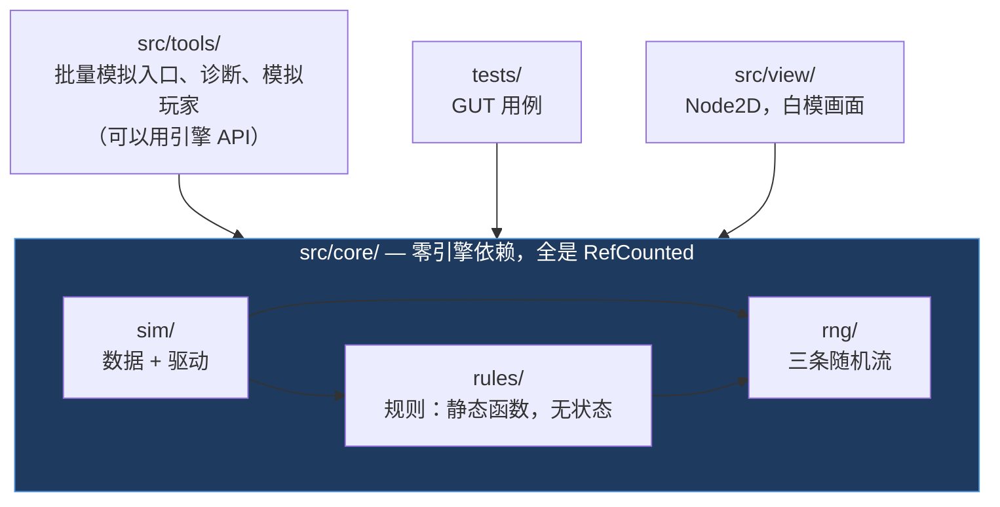
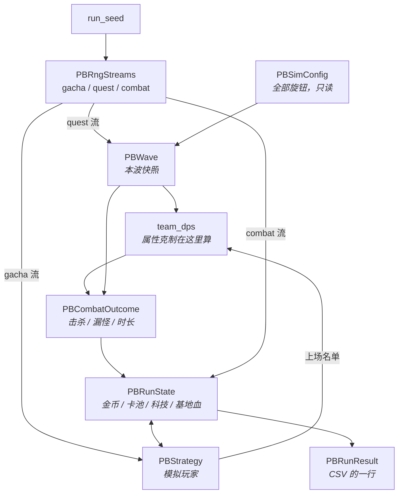

# 代码导读

写给「想看懂 `src/` 里在干什么」的人。
`src/` 约 1800 行 + `tests/` 约 760 行，17 个顶层类。

和 [Godot上手笔记.md](Godot上手笔记.md) 分工：**那份讲 Godot 通用概念**（节点树、
生命周期、语法、信号）；**这份讲本项目的结构**，以及一件反常识的事 ——
我们的代码刻意**不用**那套节点树。

---

## 0. 先说最反直觉的一点

Godot 的世界观是「**万物皆 Node**」。你打开任何一个 Godot 教程，看到的都是
节点树、`_ready()`、`_process(delta)`、`$Sprite2D`。

**但本项目 13 个核心类里，一个 Node 都没有。**

```gdscript
class_name PBRunSim
extends RefCounted     ← 不是 Node，不是 Node2D，是 RefCounted
```

| | 典型 Godot 项目 | 本项目 `src/core/` |
|---|---|---|
| 基类 | `Node` / `Node2D` | `RefCounted` |
| 谁驱动 | 引擎每帧调 `_process(delta)` | 我们自己写 `while` 循环 |
| 时间从哪来 | `delta`（每帧不定） | 固定 20 tick/s，自己数 |
| 随机数 | `randi()` | 自己持有的 `RandomNumberGenerator` |
| 怎么找到别的对象 | `get_node("Path")` | 函数参数传进去 |
| 生命周期 | `queue_free()` | 引用计数，没人引用就自动没了 |

这不是「还没写到那一步」，是**故意的**，而且有一条自动化防线守着它 ——
`check.ps1` 的第 2 阶段会 grep `src/core/`，出现 `get_node`、`randi(`、
`delta`、`extends Node` 就直接报错。

### 为什么要这么做

因为这四样能力**全部依赖同一个前提：逻辑是纯函数，输入一样输出必然一样**。

| 能力 | 靠什么 |
|---|---|
| **确定性** | 存档回滚、每日种子挑战、战报回放都要求「同种子必出同结果」 |
| **可单元测试** | `tests/` 直接 `PBRunSim.run(...)`，不用起场景、不用等帧 |
| **可 headless 批量模拟** | 23100 局跑 145 秒。带节点树的话光实例化就跑不动 |
| **可换渲染层** | 逻辑不知道自己有没有画面，M0 加 view 层时 sim 一行不动 |

一旦 sim 里混进 `get_node()` 或读了 `delta`，这四样会**一起**失效，
而且拆回来基本等于重写。所以它是「铁律」而不是「建议」。

> 用 UE 的话说：`src/core/` 是一个不依赖 `UWorld` 的纯 C++ 模块，
> 既不是 Actor 也不是 Component，你可以在命令行工具里直接链接它跑。

---

## 1. 分层与依赖方向



**箭头方向不能反。** `core` 引用 `tools` 就等于把模拟脚手架焊进了游戏逻辑，
接真 UI 时会拆不掉。

| 目录 | 能不能用引擎 API | 说明 |
|---|---|---|
| `src/core/` | **不能** | 被 `check.ps1` 阶段 2 强制 |
| `src/tools/` | 能 | 批量模拟要读命令行参数、写文件 |
| `src/view/` | 能 | 就是渲染层。**只读 sim，不回写** |
| `tests/` | 能 | GUT 本身是节点 |
| `src/player/` | — | 早期脚手架，跟游戏无关，可以删 |

---

## 2. 一局游戏是怎么跑的

入口是 [`PBRunSim.run()`](../src/core/sim/run_sim.gd)，一个 `while` 循环，
每波六步：


**顺序是刻意排的，换了结果就变：**

- **2 在 3 之前** —— 这一波抽到的卡，这一波就能上
- **4 必须在 5 之前** —— 派遣会削掉羁绊加成，进而影响 DPS
- **6 里的被动收入按战斗时长算** —— 准备阶段不限时（§01），
  让它在准备阶段产出等于挂机就是无限金币

### 数据是怎么流的



一句话：**`Config`（不变）+ `Seed`（决定随机）→ 每波生成 `Wave`，
玩家改 `State`，两者算出 `Outcome`，回写 `State`，最后汇总成 `Result`。**

---

## 3. 类速查

按职责分三组。**这个分组本身就是设计** —— 规则无状态、数据无行为、
驱动把两者串起来。

### 规则：`static` 函数，没有成员变量

调用形式一律 `PBXxxRules.某函数(...)`，不用 `.new()`。

| 类 | 文件 | 干什么 |
|---|---|---|
| `PBElement` | [rules/element.gd](../src/core/rules/element.gd) | 五系克制环。**只回答关系，不回答倍率** |
| `PBWaveRules` | [rules/wave_rules.gd](../src/core/rules/wave_rules.gd) | 属性轮转、成长曲线、波型掷骰、数量钳制 |
| `PBCombatRules` | [rules/combat_rules.gd](../src/core/rules/combat_rules.gd) | 单波战斗结算（排队模型），队伍有效 DPS |
| `PBEconomyRules` | [rules/economy_rules.gd](../src/core/rules/economy_rules.gd) | 四条收入流、科技价格、抽卡、任务表 |

> **为什么克制环和倍率要分家**：克制环是设计地基（§03 声明不可改），
> 倍率是配平旋钮（`MULT_PHYSICAL` 被策划案称为「全局最敏感的一个」）。
> 两者改动频率差几个数量级，住一起迟早有人为了调倍率误改环。

### 数据：几乎只有字段

| 类 | 文件 | 是什么 |
|---|---|---|
| `PBSimConfig` | [sim/sim_config.gd](../src/core/sim/sim_config.gd) | **全部可调参数**。想改数值先来这 |
| `PBWave` | [sim/wave.gd](../src/core/sim/wave.gd) | 一波敌人的参数快照，构造完只读 |
| `PBEnemy` | [sim/enemy.gd](../src/core/sim/enemy.gd) | 战场上的一个敌人：血量 / 属性 / 位置 |
| `PBUnit` | [sim/unit.gd](../src/core/sim/unit.gd) | 一张卡：稀有度 + 属性 + 变体 + 张数 |
| `PBRunState` | [sim/run_state.gd](../src/core/sim/run_state.gd) | 一局的全部可变状态 |
| `PBCombatOutcome` | [sim/combat_outcome.gd](../src/core/sim/combat_outcome.gd) | 一波的结算结果 |
| `PBRunResult` | [sim/run_result.gd](../src/core/sim/run_result.gd) | 一整局的结果，CSV 的一行 |

> `PBRunState` 的字段名**刻意和 §12 的存档 JSON 键对齐**。
> M4 写序列化时就是一层平铺映射，不用先做结构重构。

### 驱动与端口

| 类 | 文件 | 干什么 |
|---|---|---|
| `PBRunSim` | [sim/run_sim.gd](../src/core/sim/run_sim.gd) | 主循环。**从这里开始读代码** |
| `PBRngStreams` | [rng/rng_streams.gd](../src/core/rng/rng_streams.gd) | 三条独立随机流 + 存档状态 |
| `PBStrategy` | [sim/strategy.gd](../src/core/sim/strategy.gd) | **玩家决策的接口**（端口），见下 |

### 模拟玩家（在 `tools/`，不在 `core/`）

| 类 | 流派 |
|---|---|
| `PBStratBalanced` | `balanced` —— 均衡，也是其余几个的花钱基线 |
| `PBStratVariants` | `no_rotation` / `pure_physical` / `dispatch_never` / `dispatch_always` |
| `PBStratExtremes` | `pure_economy` / `pure_power` |
| `PBStrategyRegistry` | 按名字造实例 |

---

## 4. 三个值得单独理解的机制

### 4.1 战斗有两个模型，结果一致、用途不同

| 模型 | 类 | 用在哪 | 2100 局耗时 |
|---|---|---|---|
| **解析式排队** | [`PBCombatRules.resolve`](../src/core/rules/combat_rules.gd) | 批量校数值 | **10.4 秒** |
| **逐 tick** | [`PBBattleSim`](../src/core/sim/battle_sim.gd) | 游戏跑起来（M0 起） | **47.3 秒** |

排队模型是逐 tick 模型在「输出恒定、单目标、敌人不还手」前提下的**闭式解**，
所以两者结果对得上 —— 实测群体级别完全吻合（`balanced` 30.5 对 30.5）。
`tests/test_battle_sim.gd` 里有一组对拍断言把这个一致性锁死。

留两套是**权衡**不是遗漏：逐 tick 慢 4.5 倍，全量扫描从 2 分钟变 9 分钟，
迭代数值时不值当；但画面必须用它 —— 排队模型算完就没了，没有中间状态可画。
由 `PBSimConfig.use_tick_battle` 切换，游戏运行时恒为逐 tick。

> **动了任何一边都要跑对拍测试。** 两个模型悄悄分叉的话，
> M-1 校出来的数值和 M0 玩到的手感会对不上，而且没有任何报错。

下面讲排队模型 —— 逐 tick 模型的语义与它一致，只是把闭式解展开成了循环。

M-1 要跑上万局，逐单位逐 tick 模拟跑不动
（48 单位 × 800 tick × 120 波 × 上万局 ≈ 千亿次更新）。所以：

```
时钟 = 0
对每个敌人 i：
    时钟 = max(时钟, 它的出场时刻)      ← 打不了还没出场的
    如果 时钟 + 单个击杀耗时 <= 它抵达基地的时刻：
        算击杀，时钟推进到击杀完成
    否则：
        算漏怪，扣基地血，时钟推进到它离场   ← 已打出的伤害是沉没成本
```

**丢掉了三样东西，用结论时必须记得：**

1. **AOE 和单体输出没区别**（队列是单目标的）→ §04 那条「纯 AOE 在精英波吃力」
   的验收 M-1 答不了，留给 M0
2. **没有波内动态** —— 前排先死导致输出下降、聚拢大招把敌人拖成一堆，都不在模型里
3. **敌人不还手** —— 只有漏怪伤基地，己方单位不会死

时长仍然对齐到整 tick（20 tick/s），这样 M0 换成真模拟时两边数字能直接对照。

### 4.2 三条 RNG 流为什么必须分开

```gdscript
var gacha: RandomNumberGenerator    # 抽卡、保底
var quest: RandomNumberGenerator    # 任务刷新、波型
var combat: RandomNumberGenerator   # 掉落、暴击
```

合成一条的话，**改一次战斗掉落逻辑就会让所有旧存档的抽卡序列全变** ——
因为掉落多消耗了几个随机数，后面的抽卡就错位了。
存档回滚、每日种子、战报回放三样能力会一起失效。

还有一个不显眼但会造成静默数据损坏的坑，已经处理掉了：

> `RandomNumberGenerator.state` 是 **uint64**，而 JSON 的数字是双精度浮点，
> 超过 2^53 的部分会被**静默截断**。不报错，只表现为
> 「玩家发现退出重进能刷好卡」。所以 `to_state()` 存字符串，
> `test_rng_streams.gd` 里有一条 JSON 往返测试守着它。

### 4.3 `PBStrategy` 是一个「端口」

真实游戏里，「钱怎么花、谁上场、接不接任务」这三个决策是**玩家**在准备阶段做的。
M-1 没有玩家，所以定义一个接口，用写死的脚本冒充：

```gdscript
# 接口定义在 core/，具体流派实现在 tools/
func prepare(state, wave, cfg, rng) -> void        # 花钱
func deploy(state, wave, cfg) -> Array[PBUnit]     # 谁上场
func accept_quest(state, wave, grade, cfg) -> bool # 接不接任务
```

M0 接真 UI 时，UI 层实现同一个接口就行，`PBRunSim` 一行不动。

> 基类的 `deploy()` 默认**按「对本波的有效战力」排序取前 N** ——
> 也就是每波换上克制系。这不是随手写的默认值：§03 那 2.0 倍克制加成
> **只有玩家真的每波换人才吃得到**。全员固定上场的五系阵容平均倍率只有
> `(2.0+0.5+1.0×3)/5 = 1.10`，和纯物理的 1.05 几乎没区别。

---

## 5. Godot 侧：本项目实际用到的四件事

上手笔记里的节点、信号、场景，本项目目前**一样都没用**。真正用到的是这四个：

### 5.1 `class_name` 是全局注册 → 所以要 `PB` 前缀

**GDScript 没有命名空间。** 每个 `class_name` 都注册到全局，和 `addons/gut`、
`addons/godot_mcp` 以及引擎自带的几百个类共用一个名字空间。

叫 `Element` / `Unit` / `Strategy` 这种名字，撞名只是时间问题，
而撞名的报错往往指不到真正的位置。所以一律加 `PB`（PixelBattle）前缀。
文件名不加，仍是 `element.gd`。

### 5.2 `RefCounted` 的生命周期：不用管

```gdscript
var wave := PBWave.new()    # 就这样，没有对应的 free()
```

`RefCounted` 是**引用计数**的，没人引用了自动释放。
上手笔记里那条「一定要用 `queue_free()` 不要用 `free()`」是**针对 `Node` 的**，
本项目 `core/` 里用不上 —— 那条坑位等 M0 有了节点才会遇到。

> UE 对照：`Node` 像 `AActor`（要显式 Destroy），`RefCounted` 像
> `TSharedPtr` 管的普通对象。

### 5.3 `extends SceneTree`：命令行脚本的入口

[`batch_sim.gd`](../src/tools/batch_sim.gd) 是全项目唯一一个不是 `RefCounted`
也不是 `Node` 的脚本：

```gdscript
extends SceneTree

func _initialize() -> void:
    ...
    quit()
```

Godot 的 `--script` 参数要求脚本继承 `MainLoop` 或 `SceneTree`。
这是**替换掉整个引擎主循环**跑一段一次性代码的标准做法 ——
不开窗口、不加载主场景，跑完就退。

```powershell
godot_console --headless --path . --script res://src/tools/batch_sim.gd -- --runs 300
```

> `--` 之后的参数才归脚本（`OS.get_cmdline_user_args()`），漏了会被引擎自己吃掉。

### 5.4 静态类型不只是好看

```gdscript
var total: float = 0.0        # 走类型化指令
var total = 0.0               # 走 Variant，慢
```

带类型标注的 GDScript 走**类型化字节码**，比 Variant 版本快明显一截。
23100 局跑 145 秒就是靠这个 —— 不标类型的话可能是几倍的时间。
所以项目规范里「写类型标注」是性能要求，不只是风格。

---

## 6. 想改 X，去哪

| 想改什么 | 去哪 |
|---|---|
| **任何数值**（成长、倍率、价格、概率上限） | [`sim_config.gd`](../src/core/sim/sim_config.gd) |
| 克制环本身（谁克谁） | [`element.gd`](../src/core/rules/element.gd) 的 `COUNTERS` |
| 抽卡概率表 / 任务表 | [`economy_rules.gd`](../src/core/rules/economy_rules.gd) 的 `GACHA_TABLE` / `QUEST_TABLE` |
| 敌方属性轮转顺序 | [`wave_rules.gd`](../src/core/rules/wave_rules.gd) 的 `WAVE_ELEMENTS` |
| 战斗怎么算 | [`combat_rules.gd`](../src/core/rules/combat_rules.gd) 的 `resolve()` |
| 每波的流程顺序 | [`run_sim.gd`](../src/core/sim/run_sim.gd) 的 `run()` |
| 加一个新流派 | `tools/strategies/` 加类 + 在 `strategy_registry.gd` 注册 |
| 扫描范围 / CSV 列 | [`batch_sim.gd`](../src/tools/batch_sim.gd) |
| 画面上的颜色 / 形状 / 位置 | [`enemy_pool.gd`](../src/view/enemy_pool.gd) |
| HUD 显示什么 | [`battle_view.gd`](../src/view/battle_view.gd) |
| 查「单波为什么这么快 / 场上为什么没人」 | [`wave_pacing.gd`](../src/tools/wave_pacing.gd)，逐波打三个时间量 |

**改完必跑** `.\scripts\check.ps1`，退出码 0 才算改完。

### 几条改动会触发红灯的「防线」

这些断言守的都是**不会报错、只会静默劣化**的失效：

| 测试 | 守什么 |
|---|---|
| `test_physical_multiplier_stays_below_the_danger_line` | `MULT_PHYSICAL` ≥ 1.15 → 堆物理躺赢成最优解 |
| `test_rarity_ladder_stays_flatter_than_the_counter_bonus` | 稀有度阶梯 ≥ 1.45 → 属性策略被稀有度吃掉 |
| `test_a_static_five_element_team_barely_beats_physical` | 提醒「五系优势来自换人」，防止误判属性系统没用 |
| `test_ring_is_a_single_cycle` | 克制环退化成链 → 某个属性没人克 |
| `test_state_survives_a_json_round_trip` | uint64 被 JSON 截断 → 读档后能刷好卡 |

---

## 7. 渲染层是怎么接上的（M0）

批量模拟走的是一条「一口气跑完」的路：

```
batch_sim.gd (SceneTree) ──→ PBRunSim.run() ──→ PBRunResult
```

画面要的是「跑一个 tick 就返回」。**`src/core/` 没有为此改结构**，
只是把 `run()` 里的三段拆成了公开的静态函数，两边共用：

```
battle.tscn (Node2D)
  └── battle_view.gd ── 每 3 个物理帧步进 1 个 tick（60Hz ÷ 20 tick/s）
        ├──→ PBRunSim.plan_wave()    准备一波（花钱、选人、算 DPS）
        ├──→ PBBattleSim.step()      逐 tick 推进，画面读它的 enemies()
        ├──→ PBRunSim.settle_wave()  结算收入与基地血
        └── Enemies (enemy_pool.gd)  COUNT_CAP × 2 个节点，一次建满
```

**两边共用 `plan_wave` / `settle_wave` 是刻意的。** 各写一份的话 RNG 的调用次序
迟早分叉，「批量校出来的数值」和「实际玩到的手感」会对不上，而且不报任何错。

### 三条渲染层的规矩

1. **定帧靠数物理帧，不靠累加 `delta`。**
   `_frames_per_tick = 60 / 20 = 3`，倍速只改「每次触发步进几个 tick」，
   tick 本身的时长永远不变（铁律 2）。累加 `delta` 会引入浮点漂移，
   存档回滚和每日种子当场失效。
2. **只读，绝不回写 sim 状态。** 改状态只能走 `plan_wave` / `settle_wave`。
   `test_view_never_writes_back_to_sim_state` 守着这条。
3. **战斗中零新建节点。** 敌人节点在 `_ready()` 按 `COUNT_CAP` 一次建满，
   之后只改 `position` / `color` / `visible`。

### 属性的三层视觉编码（§02）

`640×360` 下一个敌人只有几个像素，头顶挂图标看不清，所以属性必须编码进精灵本身：

| 层 | 做法 | 为什么 |
|---|---|---|
| 主色调 | 五系各一个色相 | 最快的识别通道 |
| 剪影 | 边数不同（火 3 / 雷 4 / 风 5 / 土 6 / 水 7 / 物理 8） | **色觉障碍 + 缩放失真都会让纯色方案失效**。§02 的验收是「去色后仅凭剪影可分」 |
| 克制亮边 | 当前阵容克得住的敌人套一圈**纯白**边 | 白是唯一对六种属性色都有对比度的选择 —— 见 `RING_COLOR` 上那条注释 |

`PBStrategy` 那个接口现在仍由 `tools/strategies/` 的模拟玩家实现；
真人操作接进来时（M1）由 UI 层实现它，替换掉模拟脚本，`core/` 依旧不动。

---

## 读代码的建议顺序

1. [`sim_config.gd`](../src/core/sim/sim_config.gd) —— 先看有哪些旋钮，
   等于把整个游戏的参数面板过一遍
2. [`run_sim.gd`](../src/core/sim/run_sim.gd) —— 主循环，六十行看完全貌
3. [`element.gd`](../src/core/rules/element.gd) + [`wave_rules.gd`](../src/core/rules/wave_rules.gd) —— 最小最独立的两块规则
4. [`combat_rules.gd`](../src/core/rules/combat_rules.gd) —— 唯一有点算法的地方
5. `tests/` —— **测试是最好的用法文档**，每条断言都写了「为什么这条重要」

---

配套文档：[CLAUDE.md](../CLAUDE.md)（规范与坑位）·
[施工策划案.md](施工策划案.md)（设计规格，`§xx` 指的都是它）·
[开发路线图.md](开发路线图.md)（进度与待决策）·
[Godot上手笔记.md](Godot上手笔记.md)（引擎通用概念）
